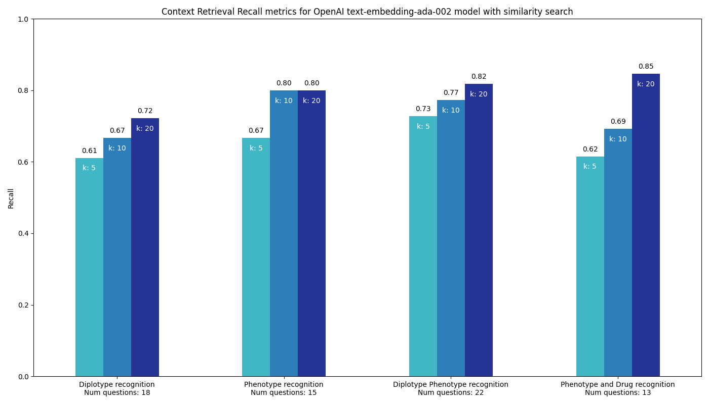
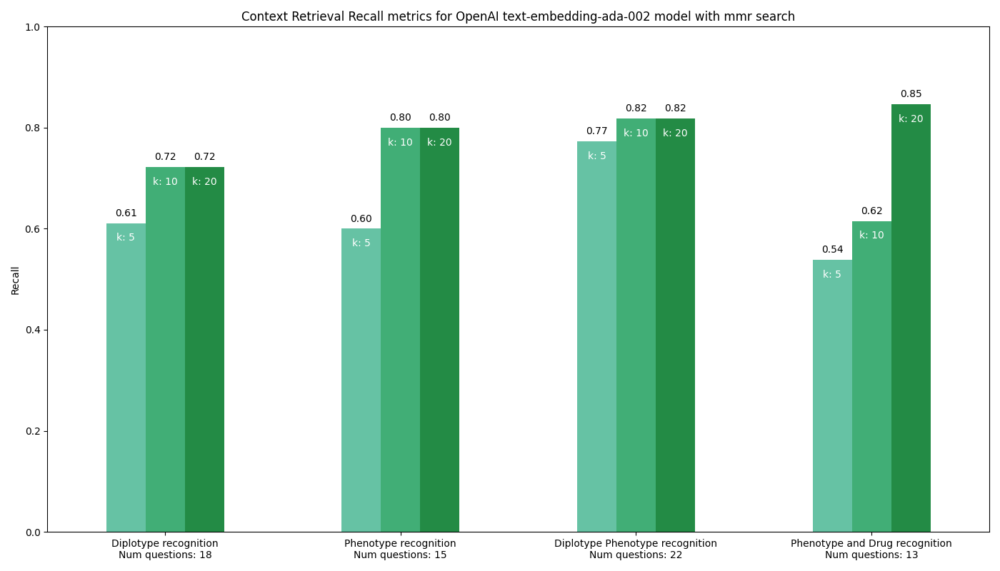

###  Performance Evaluation of the "text-embedding-ada-002" Model for PGx Context Retrieval

#### Goal:
In this section, our objective was to assess the performance of the OpenAI "text-embedding-ada-002" model in the retrieval of related context for queries posed by users against a curated KB of data and publications for statins and the genes SLCO1B1, ABCG2, and CYP2C9 based on CPIC guidelines. This retrieved context was included in the prompt to the PGx AI Assistant, see [home](https://github.com/BCM-HGSC/PGx-slco1b1-chatbot) for more details.

The curated KB that was used for this evaluation can be found [here](https://github.com/BCM-HGSC/PGx-slco1b1-chatbot/tree/main/data). This KB was converted into embeddings using OpenAI "text-embedding-ada-002" model and was loaded into a ChromaDB, instructions on upserting data into the Chroma vector store, can be found [here](https://github.com/BCM-HGSC/PGx-slco1b1-chatbot/tree/main/upsert).

#### Ground Truth and Results
To ensure a robust evaluation, we constructed a [ground truth](https://github.com/BCM-HGSC/PGx-slco1b1-chatbot/blob/main/groundtruth-eval/openai/llm_gt.csv) dataset of questions and responses. This dataset provided a benchmark for comparison, focusing on key categories like diplotype and phenotype recognition. We next retrieved context for each of the question categories in the ground truth from the KB for k values of 5, 10 and 20 and for both Maximal Marginal Relevance (MMR) and similarity search methodologies, this data is in the files prefixed with output_pagecontent_mmr_*.txt and output_pagecontent_similarity_*.txt respectively. 

We then used regular expression matching to detect a match in the context against the ground truth responses. We used binary notation i.e. 1 for matches and 0 for non-matches to record the results. Individual results can be found in this [file](https://github.com/BCM-HGSC/PGx-slco1b1-chatbot/blob/main/groundtruth-eval/openai/final_individual_summary.csv). See below for aggregate recall statistics for each ground truth category:

| Categories                        | num_questions | success_mmr_5 | success_mmr_10 | success_mmr_20 | success_similarity_5 | success_similarity_10 | success_similarity_20 |
|----------------------------------|--------------:|--------------:|---------------:|---------------:|---------------------:|----------------------:|----------------------:|
| Diplotype recognition             | 18           | 0.611111111  | 0.722222222   | 0.722222222   | 0.611111111         | 0.666666667          | 0.722222222          |
| Phenotype recognition             | 15           | 0.6          | 0.8           | 0.8           | 0.666666667         | 0.8                  | 0.8                  |
| Diplotype Phenotype recognition   | 22           | 0.772727273  | 0.818181818   | 0.818181818   | 0.727272727         | 0.772727273          | 0.818181818          |
| Phenotype and Drug recognition    | 13           | 0.538461538  | 0.615384615   | 0.846153846   | 0.615384615         | 0.692307692          | 0.846153846          |

#### Results Analysis
We conducted a comparative analysis of the results for both Maximal Marginal Relevance (MMR) and similarity searches. The accompanying graphs detail the recall metrics across varying ‘k’ values (5, 10, 20) for both MMR and similarity across all ground truth categories, offering insights into the retrieval efficacy of the model.




##### Graph 1: Performance with Similarity Search
This bar graph illustrates the recall metrics for the OpenAI "text-embedding-ada-002" model when employing a similarity search across different PGx categories. The recall values indicate how effectively the model retrieves relevant information from the KB. The metrics for diplotype recognition (with 18 questions) start at a recall of 0.61 for k=5 and peak at 0.72 for k=20. Phenotype recognition, with 15 questions, is more consistent across k values (10 and 20) with a recall of 0.80. For the combined diplotype and phenotype recognition, which involves 22 questions, the recall ranges from 0.73 at k=5 to 0.82 at k=20. Finally, for phenotype and drug recognition (with 13 questions), the recall ranges from 0.62 at k=5 to a high of 0.85 at k=20. The graph highlights that as the 'k' value increases, the recall for most categories improves, emphasizing the model's improved accuracy in retrieving more relevant results with a broader search span.

##### Graph 2: Performance with MMR Search
In contrast, the second graph demonstrates the model's performance when utilizing the Maximal Marginal Relevance (MMR) search method. Here, the recall metrics for diplotype recognition show slight variations from k=5 (0.61) to k=20 (0.72). Phenotype recognition remains consistent at 0.80 for k=10 and k=20. However, for the combined diplotype and phenotype recognition, there's a slight dip in recall at k=5 (0.77) compared to the peak recall at k=20 (0.82). For phenotype and drug recognition, the recall diminishes to 0.54 at k=5 but recovers to 0.85 at k=20. This indicates that the MMR search methodology might not always ensure the best retrieval performance at lower 'k' values, especially for specific categories like phenotype and drug recognition.

#### Summary and Recommendations:
The comparative evaluation of the OpenAI "text-embedding-ada-002" model's performance using both similarity search and MMR search methodologies for this PGx dataset reveals distinct strengths and limitations. Although the model performs admirably across many parameters, the challenges in recognizing specific PGx terminologies indicate potential areas of refinement. There were instances where specific terms were misconstrued as mere character strings, affecting the context's reliability.

To optimize future implementations and enhance biomedical data retrieval accuracy:

Further training on biomedical datasets can help in better recognition of specific PGx terminologies.
Combining both search methodologies might provide a more comprehensive retrieval performance, exploiting the strengths of each approach.
Continuous feedback loops and iterative refinements based on real-world applications will further enhance the model's efficacy in the biomedical domain.

#### DIY Instructions for Users:
If you wish to conduct a similar evaluation, create embeddings for your dataset or with our curated dataset, instructions available [here](https://github.com/BCM-HGSC/PGx-slco1b1-chatbot/tree/main/upsert). You will require a new source_metadata_mapping.py for your dataset. 

Create your groundtruth in a similar format as [this](https://github.com/BCM-HGSC/PGx-slco1b1-chatbot/blob/main/groundtruth-eval/openai/llm_gt.csv).

##### 1. Run the script  
* Ensure embeddings are available. Next run the following commands to get ground truth results, which include [final_summary.csv](final_summary.csv), [final_individual_summary.csv](final_individual_summary.csv) and output_pagecontent_**.txt for raw context data.
```
1. conda activate <virtual-environment-name>
2. cd </path/to/project>/PGx-slco1b1-chatbot/groundtruth-stats/openai
3. python ground_truth.py -y path/to/config.yaml
```
Note: the config.yaml should be the same as the one used for upserting data into vector store.

#### 2. Deactivate Virtual Environment:
* After using the application, deactivate the virtual environment with the following command:
```commandline
conda deactivate  
```
